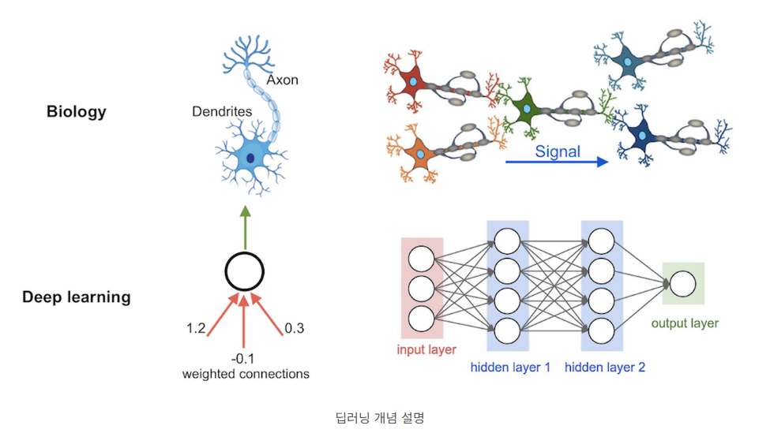

# AI

**목표** 
- ai 관련 개념 및 모델 학습

## AI란
- 사람처럼 행동하도록 만들어진 장치
  
    ***AI*** == ***자동화***

 ### 머신 러닝
  - 다량의 데이터 학습을 통해 얻어진 러닝 함수 f(x)를 찾고 이를 기반해 자동으로 답을 찾아 주는 것 

ex) 데이터 처리
  - 물체의 HSV 값, 크기 , 위치 등의 정보를 읽어 컴퓨터가 자동으로 함수 설정
  

### 딥러닝 
- 머신 러닝에 인간의 논리 구조인 인공신경망(알고리즘 구조)를 더한 기술
- 사람이 학습할 데이터를 입력하지 않아도 스스로 학습하고 예측함
  
  
  **(위: 사람의 신경망 / 아래: 딥러닝에서의 인공신경망 )**

#### 파이썬 머신 러닝 모델
- 

